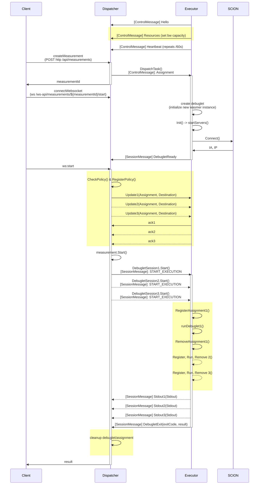

# Debuglet Software

## Prerequisite

- Go (for local standalone development and compiling WASM)
- SCION endhost stack (optional, for using SCION-specific functionality)
- Docker & Docker Compose (optional)
- OpenSSL (optional, for generating new test certificates locally)

## Local Development

[mise](https://mise.jdx.dev/) is given as a helpful tool for managing the correct language versions for local development.

The `Makefile` includes helper-targets to run certain _longer_ commands:

#### Start the dispatcher

```bash
make dispatcher # or make d
```

#### Start a executor

```bash
make executor # or make e
```

#### Generate a WASM binary

```bash
make wasm SAMPLE_DIR=local/wasm-samples/helloworld
# or
make wasm SAMPLE_DIR=local/wasm-samples/send_tcp
```

#### Build new proto files

```bash
make proto
```

### SCION

SCION is a soft-dependency for measurements. If a measurement doesn't try to call any SCION-specific functions, you can simply let the executor time-out when it tries to establish a SCION connection.

### Submitting measurements

Use the debuglet-dashboard to submit measurements.

---

## Deployment

The Debuglet ecosystem (Dispatcher and Executor) is containerized via Docker for easy setup and operation.

1. **Bootstrap Certificates and Configurations**  
   Run the following command to generate the required `configs/` structure mapped as Docker volumes, along with the necessary TLS certificates.

   ```bash
   make generate-certs
   ```

   _You can freely modify the configuration templates in `configs/executor/executor.toml` and `configs/dispatcher/dispatcher.toml` before starting the services._

2. **Start the Services**  
   You can choose to start both components at once or just one selectively:

   To start both:

   ```bash
   make docker-up-all
   ```

   To start only the executor or dispatcher:

   ```bash
   make docker-up-executor
   # or
   make docker-up-dispatcher
   ```

3. **Check Logs**  
   To view the logs from both the dispatcher and the executor, run:

   ```bash
   docker compose logs -f
   ```

4. **Tear down**  
   To stop and remove the containers, run:
   ```bash
   make docker-down
   ```

## Flow


