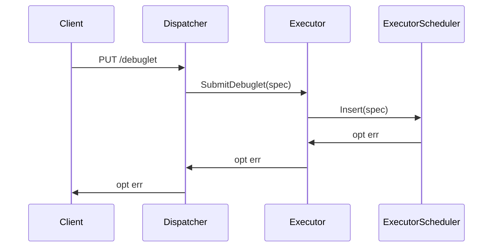
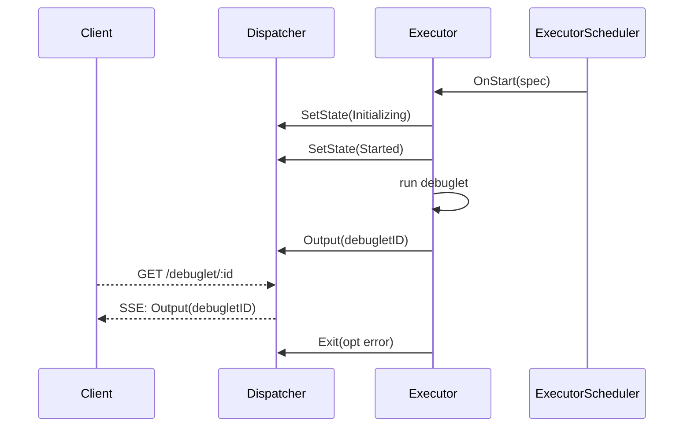
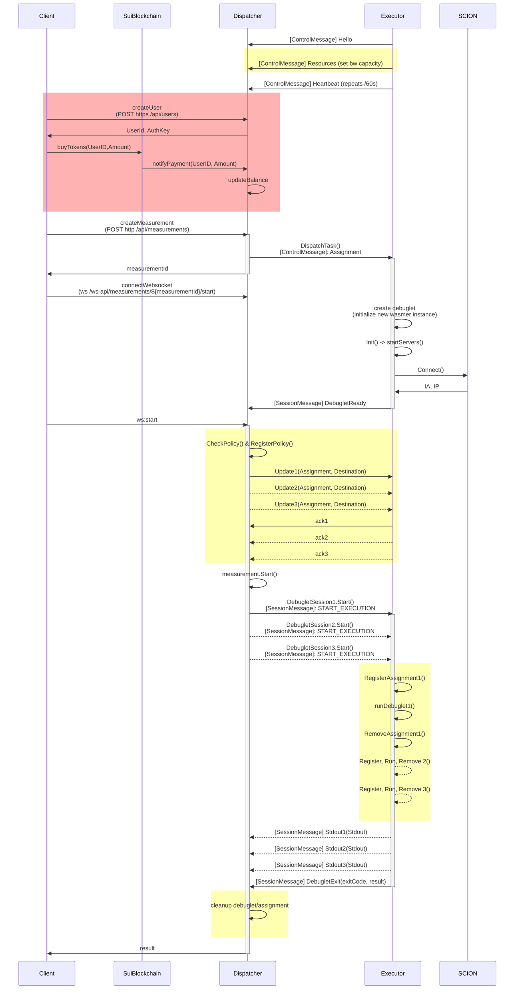

# Debuglet Software

## Prerequisite

- Go (for local standalone development and compiling WASM)
- SCION endhost stack (optional, for using SCION-specific functionality)
- Docker & Docker Compose (optional)
- OpenSSL (optional, for generating new test certificates locally)

## Local Development

[mise](https://mise.jdx.dev/) is given as a helpful tool for managing the correct language versions for local development.

The `Makefile` includes helper-targets to run certain _longer_ commands:

### Start the dispatcher

```bash
make dispatcher # or make d
```

### Start a executor

**NOTE:** Requires elevated permissions for handling packets at the kernel level (using ebpf).

```bash
make executor # or make e
```

### Generate a WASM binary

Debuglets can be written in Go, Rust, or C (and a stdout-only "hello world" in
JavaScript). `make wasm` detects the language from `SAMPLE_DIR` and writes
`debuglet.wasm` into it:

```bash
make wasm SAMPLE_DIR=local/wasm_samples/go/helloworld
make wasm SAMPLE_DIR=local/wasm_samples/go/throughput
make wasm SAMPLE_DIR=local/wasm_samples/rust/ping
make wasm SAMPLE_DIR=local/wasm_samples/c/ping WASI_SDK=/opt/wasi-sdk
```

See [local/wasm_samples/README.md](local/wasm_samples/README.md) for the
debuglet execution model, the host API, the per-language client libraries
(Go `pkg/debuglet`, the Rust `debuglet` crate, the C header), and the toolchains
each language needs.

### Build new proto files

```bash
make proto
```

### Database

Both the dispatcher and executor have their own database, which is a SQLite database by default, but can be changed out to postgres at a later time.

[sqlc](https://docs.sqlc.dev/en/stable/index.html) is used to generate typed Go-bindings from a predefined set of SQL queries defined in `internal/[dispatcher|executor]/db/query.sql`.

**Any changes to these requires re-generating the Go-bindings with `go generate ./...`.**

[goose](https://github.com/pressly/goose) is used to handle database migrations. It will automatically upgrade the database when the dispatcher or executor starts up.

### Submitting measurements

Use the debuglet-dashboard to submit measurements.

Or run the local go user client:

```bash
# send TCP GET req
go run cmd/user/main.go -wasm local/wasm_samples/go/send_tcp/debuglet.wasm -debuglets 1 -addr google.com -- -addr google.com:80 -iter 5
# send ping req
go run cmd/user/main.go -wasm local/wasm_samples/go/ping/debuglet.wasm -debuglets 1 -addr 1.1.1.1 -- -addr 1.1.1.1 -iter 10
```

The local user client allows for args to be passed through to the WASM by adding the flags after `--` at the end.

### Optional Requirements

The executor lazily loads a few things and will only complain about missing things once it actually needs them. SCION or ICMP, for example, require a special setup.

### SCION

SCION is a soft-dependency for measurements. If a measurement doesn't try to call any SCION-specific functions, you can simply let the executor time-out when it tries to establish a SCION connection.

---

## Deployment

The Debuglet ecosystem (Dispatcher and Executor) is containerized via Docker for easy setup and operation.

1. **Bootstrap Certificates and Configurations**  
   Run the following command to generate the required `configs/` structure mapped as Docker volumes, along with the necessary TLS certificates.

   ```bash
   make generate-certs
   ```

   _You can freely modify the configuration templates in `configs/executor/executor.toml` and `configs/dispatcher/dispatcher.toml` before starting the services._

2. **Start the Services**  
   You can choose to start both components at once or just one selectively:

   To start both:

   ```bash
   make docker-up-all
   ```

   To start only the executor or dispatcher:

   ```bash
   make docker-up-executor
   # or
   make docker-up-dispatcher
   ```

3. **Check Logs**  
   To view the logs from both the dispatcher and the executor, run:

   ```bash
   docker compose logs -f
   ```

4. **Tear down**  
   To stop and remove the containers, run:
   ```bash
   make docker-down
   ```

## Ansible Deployment

### Bootstrap a new system

Create the `debuglet` service user and grant passwordless sudo to your SSH user on the target host:

```bash
cd deploy/ansible && ansible-playbook bootstrap-sudo.yml -K --limit <hostname>
```

The `-K` flag prompts for the current sudo password once. After bootstrapping, all subsequent deploys run without interaction.

### Deploy

```bash
make deploy-build                        # cross-compile Linux binaries
make deploy-certs EXECUTOR_IDS="..."     # generate TLS certificates
make deploy                              # full deploy (dispatcher + executors)
# or individual:
make deploy-dispatcher
make deploy-executors
```

## Flows

### Submit Debuglet

The dispatcher checks each debuglet's floor bandwidth against per-destination and per-executor capacity over the requested time window `[start, start+timeout]`. If accepted, the debuglet is forwarded to the executor for storage and eventual execution.

The `ExecutorScheduler` stores the full specification of the debuglet and will trigger `OnStart` when the start time is right.



### OnStart Debuglet

The start of a debuglet is triggered by the executor scheduler. On initialization, the dispatcher allocates space for the output logs and can additionally check if any destinations need to be ratelimitted.

The client may connect to the debuglet endpoint with a given ID to get server-side-events for dynamic output from the debuglet.



### Legacy Full Flow


