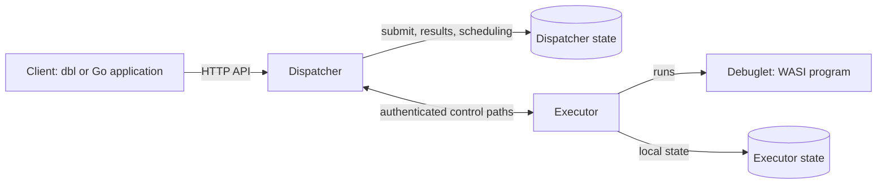

# Debuglet

Debuglet runs small WebAssembly programs for network measurements. A **dispatcher** accepts jobs and stores results. **Executors** run debuglets within their configured time and bandwidth budgets. The project includes the `dbl` command-line client, a Go client library, a Go SDK for writing debuglets, and examples.

> Debuglet is an alpha for trusted environments. Read the [security policy](SECURITY.md) before operating a networked deployment.

## Try it locally

Download the current Linux amd64 release from the [releases page](https://github.com/netsec-ethz/debuglet/releases), install it, then run:

```sh
export PATH="$HOME/.local/bin:$PATH"
dbl demo
```

The demo starts temporary local roles, runs a WebAssembly measurement, verifies the result, and cleans up. It needs no existing service, account, compiler, root access, wallet, or hand-written configuration. See [Install Debuglet](README-install.md) for the short installation path.

A successful run prints `Debuglet VERSION completed locally: ...`, its executor
and run IDs, and `Cleanup: complete`, then exits zero. If it fails, start with
[troubleshooting](docs/operations/troubleshooting.md).

## How it fits together


```mermaid
flowchart LR
    C[Client: dbl or Go application] -->|HTTP API| D[Dispatcher]
    D -->|submit, results, scheduling| DB[(Dispatcher state)]
    D <-->|authenticated control paths| E[Executor]
    E -->|runs| W[Debuglet: WASI program]
    E -->|local state| ES[(Executor state)]
```

The dispatcher exposes the API and coordinates work. Executors connect outward to it, so they do not require a public inbound control port. See the [measurement flow](docs/architecture.md#measurement-flow) for submission and execution, and [deployment topology](docs/operations/remote-deployment.md) for the operational model.

## Documentation

The versioned guides in [`docs/`](docs/README.md) are published at the [documentation site](https://debuglet.netsec.ethz.ch/docs/). Use the documentation for the release you install.

| Need | Start here |
| --- | --- |
| Install and run a local demo | [Install Debuglet](README-install.md) |
| Use the CLI | [CLI reference](docs/cli.md) |
| Write a Go application client | [Go client library](docs/client.md) |
| Write a debuglet | [Write a debuglet](docs/debuglets.md) |
| Integrate with the HTTP API | [OpenAPI contract](api/openapi.yaml) and [API guide](docs/api.md) |
| Understand the code and protocol | [Architecture](docs/architecture.md) |
| Operate a service | [Managed services](docs/operations/services.md) |
| Contribute | [Contributing](CONTRIBUTING.md) |

## Development

Debuglet development and package checks run on Linux amd64 with Go 1.25.11. From a checkout:

```sh
make ci-test
make ci-vet
make ci-build
make ci-package
```

Use [CONTRIBUTING.md](CONTRIBUTING.md) for the workflow, generated code, and review expectations.

## License

[Apache License 2.0](LICENSE).
