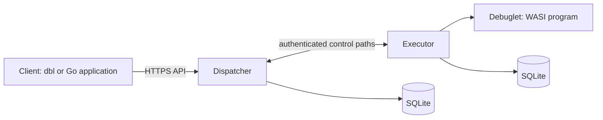

# Architecture

Debuglet has three main parts: a client submits and reads measurements, a dispatcher coordinates them, and executors run the debuglets.

## Components

| Component | Responsibility |
| --- | --- |
| Client | Creates a payment intent, submits a debuglet, and reads its state and output. |
| Dispatcher | Serves the HTTP API, authenticates accounts, schedules work, tracks executors, and stores results. |
| Executor | Connects to the dispatcher, applies local policy and resource limits, runs debuglets, and reports output and completion. |
| Debuglet | A small WASI WebAssembly program that performs one measurement. |

## Measurement flow

1. A client submits a debuglet to the dispatcher.
2. The dispatcher validates its policy and capacity, then sends it to a ready executor.
3. The executor stores and schedules the job, then runs the WebAssembly program.
4. The executor streams output and the terminal result to the dispatcher.
5. The client reads the stored state and logs through the API.

Executors initiate their connections to the dispatcher. Each active executor session needs both control paths to be healthy, which avoids exposing a public control port on the executor.

## Interfaces

- The public API is described by [`api/openapi.yaml`](../api/openapi.yaml).
- Go applications use [`pkg/client`](SDK.md).
- Debuglets use [`pkg/debuglet`](DEBUGLETS.md).
- The dispatcher/executor control protocol is defined in [`protocol/protocol.proto`](../protocol/protocol.proto).

For deployment topology, recovery, and operational guidance, use the [project Wiki](https://github.com/netsec-ethz/debuglet/wiki).
