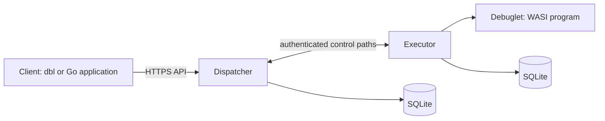
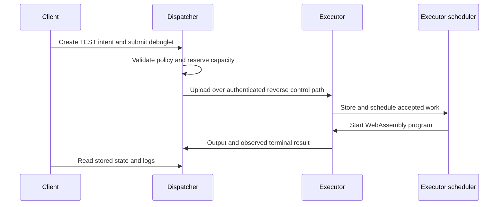

# Architecture

Debuglet has three main parts: a client submits and reads measurements, a dispatcher coordinates them, and executors run the debuglets.

## Components

| Component | Responsibility |
| --- | --- |
| Client | Creates a payment intent, submits a debuglet, and reads its state and output. |
| Dispatcher | Serves the HTTP API, authenticates accounts, schedules work, tracks executors, and stores results. |
| Executor | Connects to the dispatcher, applies local policy and resource limits, runs debuglets, and reports output and completion. |
| Debuglet | A small WASI WebAssembly program that performs one measurement. |

## Measurement flow

This is the successful TEST flow, not a payment settlement or replay protocol.
A lost connection can leave the executor's outcome unknown; reconnecting does
not resume an interrupted run. See [executor recovery](operations/executor-recovery.md).

Executors initiate their connections to the dispatcher. Each active executor session needs both control paths to be healthy, which avoids exposing a public control port on the executor.

## Interfaces

- The public API is described by [`api/openapi.yaml`](../api/openapi.yaml).
- Go applications use [`pkg/client`](client.md).
- Debuglets use [`pkg/debuglet`](debuglets.md).
- The dispatcher/executor control protocol is defined in [`protocol/protocol.proto`](../protocol/protocol.proto).

For deployment topology and operation, use [Across-host deployment](operations/remote-deployment.md), [Managed services](operations/services.md), and [Executor recovery](operations/executor-recovery.md).
